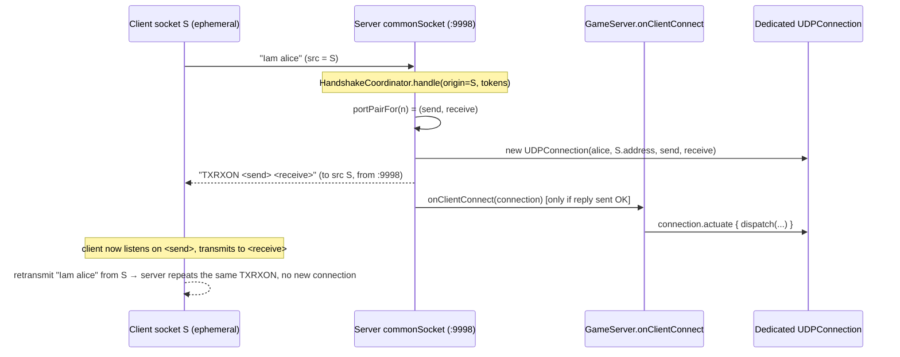

# Plan: upgrade MyGameTools to WebTools 2.0.0b

## Header / Association

- **Covers:** Feature request from Spartak Singh, relayed via a Claude Code session on
  2026-09-03, verbatim: *"Upgrade MyGameTools to the newly published WebTools 2.0.0b
  (Maven Central coordinates `io.github.spartanlaboratories:WebTools:2.0.0b`)."*
  Tracked by [SpartanLabsGaming/MyGameTools#14](https://github.com/SpartanLabsGaming/MyGameTools/issues/14).
- **Upstream release:** `SpartanLaboratories/WebTools` "Issue #1 Tier 1" — the NAT-traversal
  handshake fix. Verified against `master` at commit `c6bdbbb8`
  (*"build: release Issue #1 Tier 1 as 2.0.0b"*); `build.gradle.kts` there declares
  `coordinates("io.github.spartanlaboratories", "WebTools", "2.0.0b")`. Upstream docs:
  `docs/issue-1-nat-traversal-plan.md`, `docs/issue-1-tier-1-implementation.md`,
  `docs/issue-1-tier-1-uat.md`.
- **Branch:** `feature/14-webtools-2.0.0b-upgrade` off latest `master`.
- **Commit:** TBD — this plan document is to be committed **in the same commit as the first
  implementation stage** (the `build.gradle.kts` + `GameServer.kt` change) so
  `git log --follow` binds the two.
- **PR:** TBD
- **Status:** planning complete; open decisions resolved (see §8). Ready to execute pending
  the go-ahead to file the MyGameTools issue.
- **Target version:** GameTools `1.9.0` → `2.0.0` (major; breaking wire-protocol change —
  CONFIRMED, see §8). The version bump itself lands on a later `release/2.0.0` branch per
  `CONTRIBUTING.md`, not on the feature branch.

---

## 1. Context

### What is being upgraded

`build.gradle.kts:22-26` today:

```kotlin
api("io.github.spartanlaboratories:WebTools:2.0.0") {
    exclude(group = "io.github.spartanlaboratories", module = "GeneralTools")
}
api("io.github.spartanlaboratories:GeneralTools:2.0.1")
```

WebTools `2.0.0b` reworks the `MultiConnectionUDPServer` handshake so it survives NAT, and
in doing so changes both the wire format and the public Kotlin API that `GameServer`
extends.

### As-built facts, verified against WebTools `master` source

| # | Area | 2.0.0 (current) | 2.0.0b (as-built, verified) |
|---|------|-----------------|------------------------------|
| 1 | `onClientConnect` param | `UDPConnection` | **`Connection`** — new public interface in `com.spartanlabs.webtools.Connection`; `UDPConnection` implements it. `abstract fun onClientConnect(connection: Connection)` |
| 2 | `Connection` surface | n/a | `name: String`, `address: InetAddress`, `sendPort: Int`, `receivePort: Int`, `actuate((String)->Unit): Result<Unit>`, `terminate(): Result<Unit>`, `push(String): Result<Unit>` |
| 3 | `COMMON_SEND_PORT` / `commonSendSocket` | present (9999) | **removed** |
| 4 | `COMMON_LISTEN_PORT` | present | **kept**, value `9998` |
| 5 | Client handshake line | `Iam <name> <address>` (address required) | `Iam <name>` — any trailing token is **ignored** (`HandshakeProtocol.extraTokenCount`, logged at DEBUG). `Iam <name> <address>` still parses. |
| 6 | Server reply body | `<address> TXRXON <sendPort> <receivePort>` | **bare** `TXRXON <sendPort> <receivePort>` |
| 7 | Server reply destination | `<client-claimed address>:9999`, sent from `commonSendSocket` | **the UDP source `address:port` of the `Iam` datagram**, sent from `commonSocket` (port 9998) |
| 8 | `pushToAll` destination | each client's `<addr>:9999` | each client's **handshake origin** (`Registration.origin`), from `commonSocket` |
| 9 | Dedicated port math | steps by one (registration *n*'s send == registration *n-1*'s receive — the "one channel per server" bug) | `HandshakeProtocol.portPairFor(index)`: `send = 9999 - (2·index + 2)`, `receive = send - 1`. index 0 → `(9997, 9996)`, index 1 → `(9995, 9994)`. **Steps by two — successive registrations never collide.** |
| 10 | Retransmit handling | (re-registers) | A second `Iam` from an **already-registered origin** re-sends the existing reply and does nothing else — no new `Connection`, no second `onClientConnect`. Keyed by `InetSocketAddress` origin (`Registrations.findByOrigin`, compared by value). |
| 11 | Handshake thread start | from `init` | **still from `init`** (`MultiConnectionUDPServer.init { commonListenerThread = Thread { handshakeLoop() }... }`) |
| 12 | `GeneralTools` dependency | bundled, excluded by us | WebTools `build.gradle.kts` declares `api("io.github.spartanlaboratories:GeneralTools:2.0.1")` **directly** |
| 13 | slf4j | WebTools `slf4j-api:2.0.13` | unchanged; we pin `2.0.16` (higher; Gradle resolves to `2.0.16`) |
| 14 | Internal-only | n/a | `HandshakeProtocol`, `HandshakeCoordinator`, `Registrations`, `Registration`, `ResultExtensions.flatMap` are all `internal` — **not** usable from MyGameTools |

### Acceptance criteria

1. MyGameTools compiles and all five test levels pass against `WebTools:2.0.0b`.
2. `GameServer` extends `MultiConnectionUDPServer` with the `Connection`-typed override.
3. The fake client (`FakeClientHarness`) speaks the 2.0.0b wire format: `Iam <name>`, reads a
   bare `TXRXON` reply off the socket it sent `Iam` from.
4. Every KDoc / README / CHANGELOG statement about the handshake protocol matches 2.0.0b.
5. The `GeneralTools` `exclude` workaround is removed (redundant under 2.0.0b).
6. The breaking nature of the change for downstream game clients is documented, and a
   matching-change note is raised for `MyGameServer` / `GameGraphics`.

---

## 2. Design

### Chosen approach

A single feature branch that does four coherent things, in order:

1. **Dependency swap + API adaptation** — bump the coordinate, drop the `exclude`, retype
   `GameServer`'s connection references from `UDPConnection` to `Connection`. This is the
   minimal compilable unit; `Connection` exposes every member `GameServer` uses
   (`name`, `actuate`, `terminate`, `push`), so nothing is lost.
2. **Test-harness rewrite** — `FakeClientHarness` moves from "one socket bound to the fixed
   `COMMON_SEND_PORT`" to "one long-lived ephemeral socket that both sends `Iam` and
   receives the reply". This changes the harness's identity model: **one harness == one
   handshake origin**, so tests that need N distinct players now need N harnesses.
3. **Test updates** — fix the handshake/capacity tests that handshake multiple players
   through one harness (they would otherwise be silently reinterpreted as retransmits), and
   add a test that locks down the new retransmit-is-a-no-op behaviour.
4. **Docs** — README networking section, CHANGELOG `[Unreleased]`, and the stale KDoc.

### New handshake flow (2.0.0b)



### Alternatives considered

- **Pin `2.0.0b` but keep the `exclude` + explicit `GeneralTools`.** Rejected: the exclude
  is now pure noise (WebTools declares `GeneralTools:2.0.1` directly, identical to our pin)
  and a misleading "we had to fight the transitive graph" signal. Keeping an *explicit*
  `GeneralTools:2.0.1` line without the exclude is fine and documents our direct use of
  `Color` — see Open decisions #3.
- **Make `FakeClientHarness` open a fresh socket per `handshake()` call.** Rejected: it would
  keep the current "one harness, many players" test code compiling, but each player would
  then have a throwaway origin the server can't push back to, and it hides the real 2.0.0b
  constraint (origin == identity). Modelling one harness == one client is honest and makes
  the retransmit semantics testable.
- **Vendor a copy of `HandshakeProtocol` constants into the test module.** Rejected as
  premature; the harness only needs the two verb strings and three token indices, which are
  local `const val`s already. (A public `HandshakeProtocol` upstream would let us delete
  them — captured as a candidate WebTools issue below.)

### Staging

The four steps above map to three commits (steps 1 is one commit, see Version control).
Each commit compiles and — from commit 2 onward — passes every level. No feature flag; the
protocol change is all-or-nothing and is the point of the upgrade.

---

## 3. File-by-file changes

### `build.gradle.kts` — *plan only; executor edits*

- **Lines 20-26**, replace the WebTools + GeneralTools block with:

  ```kotlin
  // Spartan Laboratories Tools
  api("io.github.spartanlaboratories:WebTools:2.0.0b")
  // Direct dependency for the Color class; WebTools already brings the same 2.0.1.
  api("io.github.spartanlaboratories:GeneralTools:2.0.1")
  ```

  Removes the `exclude` block and the now-wrong "Drop WebTools' bundled GeneralTools"
  comment.
- **Lines 43-45 & 45-50 comments** ("A GameServer binds the fixed common UDP ports",
  "the fixed common ports"): change "ports" → "port" — 2.0.0b binds one common port (9998);
  `COMMON_SEND_PORT` is gone. The `GameServerPortsLock` build service is still required
  (single bind, still fixed) — no functional change.
- **Line 96** `coordinates(... "1.9.0")`: **not changed on the feature branch.** The bump to
  `2.0.0` happens on the subsequent `release/2.0.0` branch (see `CONTRIBUTING.md` §Releasing).

### `src/main/kotlin/com/spartanlabs/gaming/networking/GameServer.kt`

- **Line 6**, import: `import com.spartanlabs.webtools.UDPConnection` → `import com.spartanlabs.webtools.Connection`.
- **Line 71**: `private val players = ConcurrentHashMap<String, Connection>()`.
- **Line 91**: `override fun onClientConnect(connection: Connection)`. Body unchanged
  (`connection.name`, `connection.terminate()`, `players.remove(name, connection)` — identity
  removal still works; `UDPConnection` has no `equals` override, so reference equality, which
  is what we want).
- **Line 113**: `private fun admit(connection: Connection): Result<Connection>`.
- **Line 130**: `private fun listenTo(connection: Connection): Result<Unit>`. Body unchanged
  (`connection.actuate { ... }` is on the interface).
- **`push` / `disconnect` / `pushToAllPlayers` (lines ~224-255)**: no code change —
  `players.values` is now `Collection<Connection>` and `.push(...)` is on the interface.
- **Class KDoc (lines 28-57)**:
  - "listens on `COMMON_LISTEN_PORT` for `Iam <name> <address>` handshakes" → "`Iam <name>`
    handshakes (a trailing address token is accepted but ignored)".
  - "replies with `TXRXON <sendPort> <receivePort>`" → "replies, from that same common
    socket, straight back to the datagram's source address and port, with a bare
    `TXRXON <sendPort> <receivePort>`".
  - Keep the paragraph about the base class spawning its handshake thread from `init` — still
    true (fact #11) and still the reason `isFullyConstructed` exists.
  - "the common ports are fixed" → "the common port is fixed".
- **`isFullyConstructed` KDoc (lines 174-182)** and `@Suppress("SENSELESS_COMPARISON")`:
  keep as-is. The `init`-block race it guards against is unchanged in 2.0.0b.
- **`pushToAllPlayers` KDoc (lines 215-223)**: "the inherited `pushToAll`, which sends to
  each client's address on the common handshake port" → "the inherited `pushToAll`, which
  sends to each client's handshake origin over the common socket". Keep the contrast — this
  method still uses the dedicated port pair.
- **Private `andThen` extension (lines 284-295)**: KDoc note "WebTools keeps its own
  `flatMap` for this `internal`" is still accurate (`ResultExtensions.flatMap` is `internal`
  in 2.0.0b) — no change.

### `src/test/kotlin/com/spartanlabs/gaming/testing/integration/networking/FakeClientHarness.kt` — rewrite

- **Remove** `private val replies = DatagramSocket(MultiConnectionUDPServer.COMMON_SEND_PORT)`
  (line 35) — the constant no longer exists (compile break) and a fixed reply port is gone.
- **Add** one long-lived socket bound to an ephemeral local port, used for **both** send and
  receive:

  ```kotlin
  /** The one socket this fake client sends its Iam from and reads every reply on.
   *  Its local port is the handshake origin the server keys this client by. */
  private val socket = DatagramSocket()
  ```

- **`handshake(name, timeoutMillis)`**: send `"$HANDSHAKE_VERB $name"` (drop
  `${address.hostAddress}`), then `awaitReply(timeoutMillis)`, then `parseReply`.
- **`push(message)`** (private): send via `socket` (not a fresh throwaway `DatagramSocket()`)
  to `address:COMMON_LISTEN_PORT`.
- **`awaitReply(timeoutMillis)`**: `socket.soTimeout = timeoutMillis; socket.receive(packet)`.
- **`parseReply(reply)`**: bare `TXRXON <sendPort> <receivePort>`:
  - `VERB_INDEX = 0`, `SEND_PORT_INDEX = 1`, `RECEIVE_PORT_INDEX = 2`.
  - `require` message → `"Expected '$HANDSHAKE_REPLY_VERB <sendPort> <receivePort>' but got '$reply'"`.
- **`close()`**: `socket.close()`.
- **KDoc**: rewrite the class doc — *"Owns one socket, so it is exactly one handshake origin.
  A second `handshake()` on the same harness is seen by the server as a retransmit from a
  known origin: it repeats the first reply and registers nothing new. Tests that need
  several distinct players create several harnesses (`fixture.client()` per player). Multiple
  harnesses can coexist because each binds an ephemeral port, not the old fixed one."*
  Drop the "exactly one of these exists per test" and "bound to the common send port"
  sentences.
- **Imports**: `MultiConnectionUDPServer` is still referenced (`COMMON_LISTEN_PORT`), keep
  the import.

### `src/test/kotlin/com/spartanlabs/gaming/testing/integration/networking/FakePlayerChannel.kt`

- **No code change.** The dedicated data path (client listens on `serverSendPort`, transmits
  to `serverReceivePort`) is untouched by Tier 1.
- **KDoc (lines 9-20)**: the "Only one of these can exist per server … port allocation …
  steps by one rather than two …" paragraph is now **wrong** (fact #9 — 2.0.0b steps by
  two). Replace with: *"One of these per handshaken player. 2.0.0b allocates each
  registration a `(send, receive)` pair two below the previous, so a second player's ports
  never collide with the first's — several channels can be open at once."*
- Optional (not required): make `send()` reuse one socket instead of a throwaway per call —
  noted, not planned.

### `src/test/kotlin/com/spartanlabs/gaming/testing/integration/networking/ServerPorts.kt`

- No change. Data class and KDoc remain accurate.

### `src/test/kotlin/com/spartanlabs/gaming/testing/integration/networking/ServerFixture.kt`

- No code change — `client()` already mints and tracks a fresh harness per call, which is
  exactly the new multi-player pattern.
- **KDoc (line 18)**: "binds the fixed common ports in its constructor" → "port".

### `src/test/kotlin/com/spartanlabs/gaming/testing/integration/networking/GameServerHandshakeTest.kt`

- **`each player is handed its own port pair`**: currently `client.handshake("alice")` then
  `client.handshake("bob")` on **one** harness → under 2.0.0b the second call is a retransmit
  and returns alice's ports, so `assertNotEquals(first.serverReceivePort, second...)` fails.
  Fix: two harnesses —
  ```kotlin
  val first = fixture.client().handshake("alice").getOrThrow()
  val second = fixture.client().handshake("bob").getOrThrow()
  ```
  Expected: `first.serverReceivePort == 9996`, `second.serverReceivePort == 9994` (distinct).
- **`reconnecting under the same name does not count twice`**: currently reconnects through
  the same harness (now a retransmit — never re-enters `onClientConnect`, so it no longer
  exercises `GameServer`'s name-keyed replace). Fix: two harnesses, both `handshake("alice")`
  — `listenTo` does `players.put("alice", conn2)` returning `conn1`, terminates it, roster
  stays 1. Update the test name/comment to "…from a new origin".
- **`a returning player …`** is in the capacity test file (below); this file's
  `a client that completes the handshake becomes a tracked player`,
  `the handshake reply hands out a distinct dedicated port pair`, and
  `an unrecognised message is ignored …` all use a single handshake — **no change**.
- **New test** `a retransmitted Iam from the same origin does not register a second player`:
  one harness, `handshake("alice")` twice; assert `server.playerCount == 1` and the two
  `ServerPorts` are equal. Locks down fact #10 as `GameServer` observes it.

### `src/test/kotlin/com/spartanlabs/gaming/testing/integration/networking/GameServerCapacityTest.kt`

- Every test except `a server with no capacity admits nobody` handshakes 2-3 players through
  **one** `client` harness → 2.0.0b reads the 2nd/3rd as retransmits, so only the first ever
  registers and `awaitPlayers(expected = 2)` times out. Fix: one harness per distinct player:
  - `players beyond maxConnections are refused`: `h1→p1`, `h2→p2`, `h3→p3`.
  - `a refusal does not evict the players already connected`: `h1→keeper`, `h2→intruder`.
  - `a returning player is admitted even when the server is full`: `h1→alice`, `h2→alice`
    (reconnect from a new origin).
  - `a server with no capacity admits nobody`: unchanged (single handshake).
- Class KDoc note ("registers the connection and answers the handshake before it consults
  `GameServer`") is still accurate (fact: `reply(...).map { onRegistered(connection) }`) —
  no change.

### `src/test/kotlin/com/spartanlabs/gaming/testing/integration/networking/GameServerBroadcastTest.kt`

- No change. Each test does one `fixture.client().handshake("alice")` + one channel. Confirm
  green after the harness rewrite.

### `src/test/kotlin/com/spartanlabs/gaming/testing/integration/networking/GameServerInputTest.kt`

- No change (`channelFor` = one harness, one handshake). Confirm green.

### `src/test/kotlin/com/spartanlabs/gaming/testing/e2e/ClientServerRoundTripTest.kt`

- No change — one `FakeClientHarness`, one `connect()` per test; the harness's public
  signature (`handshake(name): Result<ServerPorts>`) is unchanged. Confirm green — this is
  the end-to-end proof the new reply path works over real loopback sockets.

### `src/test/kotlin/com/spartanlabs/gaming/testing/nonfunctional/GameServerRobustnessTest.kt`

- No change — one harness, one connect. Confirm green.

### `src/test/resources/logback-test.xml`

- No change. Every new 2.0.0b class is still under `com.spartanlabs.webtools`, so the
  existing `<logger name="com.spartanlabs.webtools" level="INFO"/>` still applies. (2.0.0b's
  `HandshakeCoordinator` logs "Registered connection…" at INFO — acceptable and useful.)

### `README.md`

- **Line ~137** (Networking feature bullet): "handles the `Iam <name> <address>` handshake"
  → "handles the `Iam <name>` handshake (NAT-traversable as of WebTools 2.0.0b)".
- **Lines ~152 / ~159 / ~168** (install snippets, currently `1.8.0` — already stale vs the
  released `1.9.0`): bump to the release version (`2.0.0`) on the `release/2.0.0` branch, not
  here. Flag the pre-existing `1.8.0`/`1.9.0` drift to the executor.
- **Line ~172** (transitive-deps note): optionally name the version — "brings in WebTools
  2.0.0b". Low priority.
- **Architecture section (lines ~31-116)**: no structural change; optionally add one line to
  the `GameServer` row/notes that the handshake is now NAT-traversable. Optional.
- The version bump + Maven-badge currency ride the `release/2.0.0` branch.

### `CHANGELOG.md`

- Under `## [Unreleased]`, add (this is a **breaking** entry → drives the `2.0.0` major):

  ```
  ### Changed
  - **BREAKING — GameServer wire protocol (WebTools 2.0.0b).** Clients now send `Iam <name>`;
    the old trailing `<address>` token is accepted but ignored. The server's handshake reply
    is now a bare `TXRXON <sendPort> <receivePort>` (no leading address) sent back to the UDP
    source of the `Iam` datagram instead of `<clientAddress>:9999`. A client must therefore
    read the reply — and any common-channel broadcast — on the same socket it sent `Iam`
    from. `COMMON_SEND_PORT` is gone. This makes the handshake work through NAT.

  ### Dependencies
  - WebTools `2.0.0` → `2.0.0b`; dropped the now-redundant `GeneralTools` exclude
    (WebTools 2.0.0b depends on `GeneralTools:2.0.1` directly).
  ```

- Add the `[2.0.0]` heading + `compare` link refs on the `release/2.0.0` branch.

---

## 4. Documentation impact (Audience-Reach rings)

| Ring | Touched? | What moves with the change |
|------|----------|----------------------------|
| **Inner core** (in-editor) | Yes (light) | `//region` groups in every edited file stay intact; import groups updated (`Connection` replaces `UDPConnection` under `// 1.1 Spartan Laboratories`). |
| **Component ring** (KDoc) | **Yes (primary)** | `GameServer` class KDoc + `onClientConnect` / `admit` / `listenTo` / `pushToAllPlayers` KDoc; `FakeClientHarness` + `FakePlayerChannel` + `ServerFixture` KDoc. |
| **Boundary ring** (protocol) | **Yes (primary)** | The `Iam` / `TXRXON` handshake is a cross-process protocol. `README.md` networking section + `CHANGELOG.md` must state the new format and the "reply returns to the `Iam` source socket" contract. Downstream repos (`MyGameServer`, `GameGraphics`) need the matching client-side note — see Risks. |
| **Architectural outer layer** | Optional | `README.md` architecture section may note the handshake is now NAT-traversable; the Mermaid sequence diagram above can be lifted into `README.md` if desired. Not required for correctness. |

Per the global README-currency rule: the protocol change and the dependency change both
alter the project's external shape, so `README.md` and `CHANGELOG.md` **must** move in the
same PR (docs commit).

---

## 5. Test plan (5-level hierarchy)

All networking tests that exist are Level 3 and above; `GameServer` has no Level 1/2 tests
today (its logic is thin and socket-bound).

| Level | Package | Path | Behaviours locked down | Change |
|-------|---------|------|------------------------|--------|
| 1 — gating | — | — | none touch WebTools | none |
| 2 — component | `com.spartanlabs.gaming.testing.component.*` | — | `GameServer` has none; a `Connection` fake now makes them *possible* but that is a follow-up (Open decisions #6) | none |
| 3 — integration | `com.spartanlabs.gaming.testing.integration.networking` | `src/test/kotlin/com/spartanlabs/gaming/testing/integration/networking/` | handshake → tracked player; bare `TXRXON` parsed off the send socket; **distinct** dedicated port pairs across two origins (`9996` vs `9994`); reconnect under the same name from a **new** origin replaces the old connection; **retransmit from the same origin registers nothing new** (new test); capacity cap enforced with N distinct origins; refusal does not evict sitting players; broadcast filtering + polymorphic snapshot tagging; `INPUT` routing vs raw messages | `FakeClientHarness` rewrite; `FakePlayerChannel`/`ServerFixture` KDoc; `GameServerHandshakeTest` + `GameServerCapacityTest` multi-harness fixes; **+1 new test** |
| 4a — deterministic | `...testing.deterministic` | — | pure game/stat/collision logic — unaffected | none |
| 4b — e2e | `com.spartanlabs.gaming.testing.e2e` | `.../e2e/ClientServerRoundTripTest.kt` | full client→server→simulation→client loop over the **new** reply path; hidden-object filtering end to end; malformed-frame resilience | none (must stay green) |
| 4c — nonfunctional | `com.spartanlabs.gaming.testing.nonfunctional` | `.../nonfunctional/GameServerRobustnessTest.kt` | 300-datagram malformed burst + oversized datagram do not kill the listener or evict the player, on the new handshake | none (must stay green) |
| 5 — UAT | — | — | interop with the **real** `MyGameServer` / `GameGraphics` client is the actual acceptance test | manual; blocked on the downstream client change |

### Optional additional Level 3 test (Open decisions #5)

`two players can each open their own dedicated channel at once` — handshake two harnesses,
open a `FakePlayerChannel` for each, `server.push("p1", …)` / `server.push("p2", …)`, assert
each channel receives only its own message. Locks in the 2.0.0b step-by-two port math that
lifts the old one-channel-per-server limit.

### What cannot be automated here

- **Real NAT traversal** — loopback tests can't exercise it; that is WebTools' own
  `docs/issue-1-tier-1-uat.md` territory.
- **Interop with the real downstream client** — needs `MyGameServer` / `GameGraphics`
  updated first.

### Baseline to establish before starting

Run `./gradlew test` on `master` (WebTools 2.0.0) and record it green, so any post-upgrade
failure is attributable. `CONTRIBUTING.md`: JDK 23, Gradle wrapper 9.7.1.

---

## 6. Risks & edge cases

- **Breaking change for GameTools consumers.** Downstream game clients built against
  GameTools `1.9.0` will break on the reply path: they must (a) stop binding a listener on
  port `9999` for the reply and instead read it on the socket they sent `Iam` from;
  (b) parse a **bare** `TXRXON` (verb at token index 0, not 1); (c) they *may* keep sending
  `Iam <name> <address>` during migration — the extra token is ignored — but the reply
  delivery still changes. → **major bump `1.9.0` → `2.0.0`** with a `feat(networking)!:` +
  `BREAKING CHANGE:` footer.
- **Cross-repo lockstep.** `SpartanLabsGaming/MyGameServer` and `SpartanLabsGaming/GameGraphics`
  (whichever implements the client side of this handshake) need the matching change **before**
  GameTools `2.0.0` is usable end to end. MyGameTools is a library — its only in-repo "client"
  is `FakeClientHarness`, which this plan updates. Action: the parent should open tracking
  issues on `MyGameServer` and `GameGraphics` ("adopt the WebTools 2.0.0b bare-`TXRXON`
  handshake") and decide release ordering (Open decisions #4). A `-SNAPSHOT` publish from
  `master` is the staging analogue for them to integrate against (`CONTRIBUTING.md`
  §Deployment).
- **Source-compat break on `Connection` vs `UDPConnection`.** Any consumer that subclassed
  `MultiConnectionUDPServer` directly, or referenced `UDPConnection` in an `onClientConnect`
  override, breaks at compile time. Within MyGameTools only `GameServer` does this; downstream
  normally uses `GameServer`, not the base class.
- **Test semantics silently changing.** The old capacity/reconnect tests do not merely
  weaken under 2.0.0b — they **fail** (`awaitPlayers(expected = 2)` times out), so the
  regression is loud, not silent. Good.
- **`GeneralTools` resolution.** After dropping the `exclude`, both MyGameTools and WebTools
  declare `GeneralTools:2.0.1` — identical, no conflict. Executor should run
  `./gradlew dependencies --configuration runtimeClasspath` and confirm `GeneralTools`
  resolves to `2.0.1` and `slf4j-api` to `2.0.16`.
- **slf4j 2.0.13 vs 2.0.16.** Gradle picks the higher (`2.0.16`); no API break between these
  patch lines. Note in the commit body.
- **Port math / `GameServerPortsLock`.** Still one fixed common port bind (`9998`), so the
  single-permit build service is still needed and unchanged. Dedicated ports now
  `9997/9996, 9995/9994, …` — all below `9998`, no overlap with the common port.
- **`FakePlayerChannel` multi-channel.** The one-channel-per-server limit is lifted, but no
  existing test opens two channels, so the risk of the stale assumption biting is low;
  the optional test above de-risks it.
- **Concurrency.** Unchanged model: `onClientConnect` still runs on the `init`-started
  listener thread; `players` is still `ConcurrentHashMap`; `isFullyConstructed` still guards
  the constructor race. No new concurrency surface.

---

## 7. Version control

- **Branch:** `feature/14-webtools-2.0.0b-upgrade` off latest `master`
  (or `chore/webtools-2.0.0b-upgrade` — Open decisions #2).
- **Commits** (Conventional Commits; semi-linear — rebase locally, `--no-ff` merge via PR;
  "Create a merge commit" is the only enabled merge button):

  1. `feat(networking)!: adopt the WebTools 2.0.0b NAT-traversal handshake`
     — `build.gradle.kts` (coordinate bump, drop `exclude`, comment fixes),
     `GameServer.kt` (`Connection` retype + KDoc), **and this plan document**
     (`docs/webtools-2.0.0b-upgrade-plan.md`) so `git log --follow` binds plan to code.
     Body: note slf4j 2.0.16 wins over WebTools' 2.0.13; `Refs #14`.
     Footer: `BREAKING CHANGE: GameServer clients send "Iam <name>" and read a bare
     "TXRXON <sendPort> <receivePort>" reply on the socket they sent "Iam" from; the reply
     no longer targets <address>:9999 and COMMON_SEND_PORT is removed.`
  2. `test(networking): drive the 2.0.0b bare-TXRXON handshake from the fake client`
     — `FakeClientHarness.kt` rewrite, `FakePlayerChannel.kt` / `ServerFixture.kt` KDoc,
     `GameServerHandshakeTest.kt` + `GameServerCapacityTest.kt` multi-harness fixes, new
     retransmit test (+ optional two-channel test).
  3. `docs: record the WebTools 2.0.0b handshake protocol change`
     — `README.md` networking bullet, `CHANGELOG.md` `[Unreleased]`.

  (Commits 1 and 2 could be split further, but commit 1 must contain both the build bump and
  the `GameServer` retype to stay compilable.)

- **Trailers on every commit:**

  ```
  Co-Authored-By: Claude Sonnet 5 <noreply@anthropic.com>
  Claude-Session: https://claude.ai/code/session_01K6eUafUdRrChVYojCBxwkm
  ```

- **PR:** title = a valid Conventional Commit (e.g. the commit-1 subject); fill the template;
  `Closes #14`; CI green; **Update with rebase** to stay current with `master`; merge
  commit, then delete the branch.
- **Release (separate branch, later):** `release/2.0.0` — bump `coordinates(... "2.0.0")` in
  `build.gradle.kts`, move `CHANGELOG.md` `[Unreleased]` under `## [2.0.0] — <date>`, add the
  `compare` link refs, bump the `README.md` install snippets to `2.0.0`. Merge commit
  `chore(release): 2.0.0`, then tag `v2.0.0`, then the manual
  `./gradlew publishAndReleaseToMavenCentral`.
- **Working tree:** clean at planning time (`git status` clean) — nothing unrelated to carve
  out.

---

## 8. Open decisions

**Resolved 2026-09-03 by Spartak (Claude Code session):**

1. **Version bump → `2.0.0` (major). CONFIRMED.** `feat(networking)!:` with a
   `BREAKING CHANGE:` footer. The bump itself lands on the later `release/2.0.0` branch.
2. **File a MyGameTools issue first. CONFIRMED.** File "Upgrade to WebTools 2.0.0b
   (NAT-traversal handshake)" on `SpartanLaboratories/MyGameTools`; branch
   `feature/14-webtools-2.0.0b-upgrade`.
4. **Release ordering: SNAPSHOT first, tag later. CONFIRMED.** Merge to `master`, publish a
   `-SNAPSHOT`, let `MyGameServer` / `GameGraphics` integrate against it, tag `v2.0.0` only
   once their matching client change is at least drafted. Open tracking issues on both repos.

**Going with the plan's recommendation (no objection raised):**

3. **`GeneralTools` declaration style.** Keep an explicit
   `api("io.github.spartanlaboratories:GeneralTools:2.0.1")` without the `exclude` — it
   documents the direct `Color` use.
5. **Add the two-channel Level 3 test. YES.** Locks in the 2.0.0b step-by-two port math
   (fact #9) that lifts the one-channel-per-server limit.
6. **Level 2 component tests for `GameServer` against a fake `Connection`.** Deferred to a
   follow-up issue — out of scope for this upgrade.

---

## 9. Sequencing & follow-ups

1. Establish the green baseline on `master` (`./gradlew test`).
2. (If Open decisions #2 = yes) file the MyGameTools issue; branch.
3. Commit 1 (build + `GameServer` + this plan) → verify `./gradlew compileKotlin compileTestKotlin`.
4. Commit 2 (test harness + tests) → `./gradlew integrationTest e2eTest nonfunctionalTest`,
   then `./gradlew test`.
5. Commit 3 (README + CHANGELOG) → `./gradlew dokkaGeneratePublicationHtml` to catch broken
   KDoc links.
6. PR → CI green → rebase-update → merge.
7. Separate `release/2.0.0` PR: version bump, CHANGELOG heading, README install snippets,
   tag, manual publish.

### Deliberately left for later

- Level 2 component tests for `GameServer` against a fake `Connection` (Open decisions #6).
- `FakePlayerChannel.send()` reusing a single socket instead of a per-call throwaway.
- WebTools Tier 2 (the *data* path is still not NAT-traversable — tracked upstream as
  `SpartanLaboratories/WebTools#1`); when it lands, MyGameTools' dedicated-channel model and
  `FakePlayerChannel` will need another pass.

### Filed: [SpartanLaboratories/WebTools#3](https://github.com/SpartanLaboratories/WebTools/issues/3)

**Title:** *2.0.0b: no public client-side handshake support; the reply-socket contract is
prose-only*

**Body sketch:** Consuming `MultiConnectionUDPServer` 2.0.0b from MyGameTools (and writing
its `FakeClientHarness`) surfaces three rough edges:

- **No client counterpart.** Every consumer must hand-roll "send `Iam` from a long-lived
  socket, read the bare `TXRXON` back *on that same socket*, then open the dedicated pair".
  The "same socket" requirement — the crux of the NAT fix — lives only in `KDoc` prose, so it
  is easy to get wrong (bind a separate listener and the reply is silently lost). A
  `MultiConnectionUDPClient` (or a documented `HandshakeClient` helper) would make the
  contract executable.
- **The wire format is not available to parse against.** `HandshakeProtocol` (verbs,
  `txrxonReply`, `parseHandshake`, `portPairFor`, `DEDICATED_PORT_BASE`) is `internal`, so
  clients and test harnesses re-declare `"Iam"` / `"TXRXON"` string literals and token
  indices by hand. Publishing the pure `HandshakeProtocol` would remove that duplication.
- **`Connection` hides the handshake origin.** The interface exposes `address` and the
  dedicated `sendPort` / `receivePort`, but not the `InetSocketAddress` origin the server
  keys the client by. A subclass that wants to push its own datagram over the common channel
  to one specific client cannot. `GameServer` does not need this today, but the asymmetry is
  worth noting.

Proposed fix: publish `HandshakeProtocol`; add a minimal client-side handshake helper; and
either expose the origin on `Connection` or document that common-channel sends are
`pushToAll`-only.

---

*Status: planning only. No source, test, or build file has been modified.*
