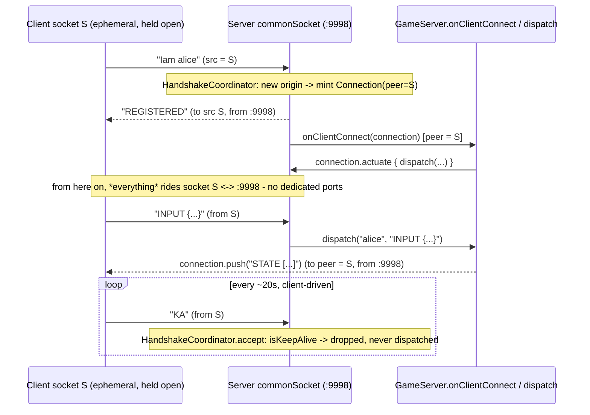

# Plan: upgrade MyGameTools to WebTools 2.0.0c

## Header / Association

- **Covers:** Feature request from Spartak Singh, relayed via a Claude Code session on
  2026-09-04, verbatim: *"Upgrade the `io.github.spartanlaboratories:WebTools` dependency in
  this repo (MyGameTools) from the currently pinned `2.0.0b` to the latest published `2.0.0c`
  on Maven Central, and adapt the codebase to the breaking change it carries."* Not tracked by
  an open `SpartanLabsGaming/MyGameTools` issue at planning time — the three currently open
  issues (`Alive.cancelAttack()`, an `Alive` attack-target bug, broadcast-snapshot identity)
  are unrelated. See Open decisions #1 for whether to file one before branching, matching the
  `2.0.0b` upgrade's precedent.
- **Upstream release:** `SpartanLaboratories/WebTools` Issue #1 Tier 2 — the NAT-traversable
  *data* path. Verified against `master`: `build.gradle.kts` there declares
  `coordinates("io.github.spartanlaboratories", "WebTools", "2.0.0c")`; source files read in
  full: `Connection.kt`, `UDPConnection.kt`, `MultiConnectionUDPServer.kt`,
  `HandshakeProtocol.kt`, `HandshakeCoordinator.kt`. Upstream doc referenced in that source:
  `docs/issue-1-tier-2-plan.md` §2.1 (sequence diagram for the canonical end-to-end flow).
- **Branch:** `feature/<issue#>-webtools-2.0.0c-upgrade` off latest `master` (issue number TBD
  — see Open decisions #1; falls back to `chore/webtools-2.0.0c-upgrade` if no issue is filed).
- **Commit:** TBD — this plan document is to be committed **in the same commit as the first
  implementation stage** (the `build.gradle.kts` + `GameServer.kt` KDoc change) so
  `git log --follow` binds the two.
- **PR:** TBD
- **Status:** planning only. No source, test, or build file has been modified.
- **Target version:** GameTools `2.0.0` → `3.0.0` (major; second consecutive breaking
  wire-protocol change — see Open decisions #2). The version bump itself lands on a later
  `release/3.0.0` branch per `CONTRIBUTING.md` §Releasing, not on this feature branch.
- **Related docs:** `docs/webtools-2.0.0b-upgrade-plan.md` (the Tier 1 upgrade this one
  continues; its "Deliberately left for later" section flags Tier 2 by name).

---

## 1. Context

### What is being upgraded

`build.gradle.kts:21` today:

```kotlin
api("io.github.spartanlaboratories:WebTools:2.0.0b")
```

WebTools `2.0.0c` (Tier 2) removes per-client dedicated UDP ports entirely and multiplexes
**all** traffic — handshake, application data, broadcasts, keepalives — over the one shared
`commonSocket` (`COMMON_LISTEN_PORT`, 9998) that Tier 1 already used for the handshake. Tier 1
made the *handshake* NAT-traversable; Tier 2 finishes the job for the *data* path, which until
now still relied on a dedicated `(sendPort, receivePort)` pair per client that does not survive
NAT (the very limitation the previous plan's "Deliberately left for later" section named).

### As-built facts, verified against WebTools `master` source

| # | Area | 2.0.0b (current) | 2.0.0c (as-built, verified) |
|---|------|-------------------|------------------------------|
| 1 | `Connection` surface | `name`, `address: InetAddress`, `sendPort: Int`, `receivePort: Int`, `actuate`, `terminate`, `push` | **`address`/`sendPort`/`receivePort` removed**; adds `peer: InetSocketAddress` (the client's post-NAT endpoint) and `keepAlive(): Result<Unit>` (one-shot server→client keepalive datagram to `peer`; caller schedules it). `name`, `actuate`, `terminate`, `push` unchanged in signature. |
| 2 | Handshake reply | bare `TXRXON <sendPort> <receivePort>` | bare single token **`REGISTERED`** — no arguments (`HandshakeProtocol.REGISTERED_REPLY`) |
| 3 | Data path | dedicated `UDPConnection` per client, bound to its own `sendPort`/`receivePort` | **gone** — `UDPConnection.push`/`actuate` route through the one shared `commonChannel`, addressed to `Connection.peer` |
| 4 | Keepalive | none | new token **`KA`** (`HandshakeProtocol.KEEPALIVE_TOKEN`). `HandshakeCoordinator.accept` intercepts a bare `KA` **before** the handshake/data classification and drops it (`Result.success`, never dispatched) — a registered player's `onMessage` handler never sees it. Clients are expected to send it on an idle interval (~20 s recommended) from the same socket they handshook on, to keep their NAT mapping warm. |
| 5 | `COMMON_LISTEN_PORT` | 9998 | unchanged, 9998 — now the *only* port `MultiConnectionUDPServer` ever binds |
| 6 | `UDPConnection` constructor | already `internal` in practice (only WebTools minted it) | now explicitly `internal constructor` — not directly relevant, MyGameTools never constructed one |
| 7 | `MultiConnectionUDPServer.onClientConnect` / `start` / `pushToAll` / `stop` | present | **signatures unchanged.** `pushToAll` still broadcasts to `registrations.snapshot()` — see fact #8, which is new information this plan surfaces, not a signature change |
| 8 | **Registration lifetime** (confirmed by reading `HandshakeCoordinator.kt` / had to check, not previously documented) | `Registrations` never removes an entry once added; `terminate()` (`UDPConnection.terminate` → `channel.unbind`) only clears `onMessage`, it does **not** deregister | **same in 2.0.0c** — this was already true under Tier 1, but Tier 1's `GameServer.pushToAllPlayers` KDoc masked it by pointing at a (then-real) "different port" distinction. With per-player ports gone, that KDoc is now flatly wrong and the *real* distinction (below) needs to be the documented one. |

### Acceptance criteria

1. MyGameTools compiles and all five test levels pass against `WebTools:2.0.0c`.
2. `GameServer`'s Kotlin API surface is **unchanged** — it already used only
   `Connection.name` / `.actuate` / `.terminate` / `.push`, none of which changed shape. Its
   KDoc, which describes the wire protocol in prose, is corrected to match 2.0.0c.
3. `FakeClientHarness` and every test that drove the old dedicated-port data path
   (`FakePlayerChannel`, `ServerPorts`) are rewritten to speak the single-socket protocol:
   `Iam <name>` → bare `REGISTERED`, then all further traffic on that same socket.
4. `GameServer.pushToAllPlayers`'s KDoc states the real, now-only distinction from the
   inherited `pushToAll` (fact #8), not the retired "dedicated port pair" one.
5. Every KDoc / README / CHANGELOG statement about per-player ports is removed or corrected.
6. The breaking nature of the change for downstream game clients (anything that hand-rolls the
   wire protocol rather than going through GameTools' `GameServer`) is documented, and a
   matching-change note is raised for `MyGameServer` / `GameGraphics` per Open decisions #4.

---

## 2. Design

### Chosen approach

Same three-stage shape as the `2.0.0b` upgrade, because `GameServer`'s Kotlin API needs no
code change this time — only its KDoc and its test doubles do:

1. **Dependency bump + KDoc correction** — bump the coordinate; every sentence in
   `GameServer.kt` that describes "dedicated ports" is rewritten to describe the single shared
   socket, including the `pushToAllPlayers` vs. `pushToAll` distinction (resolved below, not
   left ambiguous).
2. **Test-harness collapse** — `FakePlayerChannel` (the dedicated-port client-side channel) and
   `ServerPorts` (the parsed port-pair value) are deleted outright: there is no port pair left
   to parse or to open a dedicated socket against. Their entire responsibility — sending and
   receiving a connected player's application traffic — folds into `FakeClientHarness`, because
   under 2.0.0c **the handshake socket *is* the data socket**. Every test that used to do
   `val ports = harness.handshake(name).getOrThrow(); val channel = fixture.channel(ports)` now
   just keeps the harness itself and calls `.push(...)` / `.receive()` on it directly.
3. **Test updates** — fix every call site that threaded a `ServerPorts`/`FakePlayerChannel`
   through, delete the two handshake tests that asserted on port-pair contents (nothing left to
   assert), and add one new integration test locking down fact #4 (`KA` is swallowed, never
   reaches `onPlayerMessage`/`onPlayerInput`).
4. **Docs** — README networking section + architecture table, `CHANGELOG.md` `[Unreleased]`.

### The `pushToAllPlayers` vs. inherited `pushToAll` question — resolved, not left open

The task brief flagged this as a call to make explicit. Having read `HandshakeCoordinator.kt`
and `Registrations.kt`, it is not ambiguous: **the two methods do still differ, but not for the
reason the old KDoc gave, and the real reason is more consequential than "which socket".**

- `pushToAllPlayers` (GameServer) sends only to `players.values` — the roster `GameServer`
  itself currently admits and tracks. A player refused for being over `maxConnections`, or the
  stale `Connection` of someone who has since reconnected from a new origin, is never in this
  map (`onClientConnect`'s failure path removes-by-value / `listenTo`'s reconnect path
  overwrites it).
- `pushToAll` (inherited, `MultiConnectionUDPServer.pushToAll` → `HandshakeCoordinator.broadcast`)
  sends to **every entry `registrations.snapshot()` has ever accumulated for this server
  instance** — because `Registrations` has no removal path short of `stop()`'s `terminateAll()`,
  and `Connection.terminate()` only clears the bound handler, it does not deregister. That
  includes:
  - every player `GameServer.admit` refused for being over capacity (still handshook
    successfully at the WebTools layer before `GameServer` ever saw it — fact from the existing
    `GameServerCapacityTest` KDoc, carried forward),
  - the stale `Connection` of a name that later reconnected from a new origin.

So `pushToAll`, called on a `GameServer`, can silently keep sending datagrams to origins
`GameServer` itself no longer considers connected, for the lifetime of the server. This was
already true under `2.0.0b` — it just used to be hidden behind a (then-accurate, now-retired)
"this one uses the dedicated port pair" sentence that gave a plausible-sounding but wrong reason
for the two methods differing. **Decision: keep both methods, correct
`pushToAllPlayers`'s KDoc to state the real distinction, and steer callers toward
`pushToAllPlayers` for anything that means "the players I currently think are connected".** No
code change to either method — `pushToAll` is not `open` in the base class, so `GameServer`
cannot override or hide it even if it wanted to; the fix is documentation-only. This growing
registration list is itself a WebTools-side design gap worth surfacing upstream — see Risks.

### New data-path flow (2.0.0c)



### Alternatives considered

- **Keep `FakePlayerChannel` as a thin wrapper delegating to the harness's socket.** Rejected:
  there is no longer a second port to wrap, and the type's whole reason to exist — "the client
  end of a dedicated connection" — is gone. Keeping the type as a pass-through alias would only
  preserve churn-avoidance at the cost of a misleading name; deleting it and folding its two
  methods into `FakeClientHarness` is the honest model.
- **Give `FakeClientHarness` a public `keepAlive()` and have every existing test call it on a
  timer.** Rejected as unnecessary: `HandshakeCoordinator` has no eviction or idle-timeout logic
  keyed on `KA` (confirmed by reading `receiveLoop`/`accept` — there is no timer anywhere in the
  class), so no existing test's correctness depends on keepalives actually being sent over
  loopback. Instead, add the narrower `sendKeepAlive()` capability plus exactly one new test
  that proves the server-observable contract (`KA` is swallowed, not delivered) — see Design
  point 3 and the test plan. This is a resolved design choice, not left open, because it follows
  directly from reading `HandshakeCoordinator.accept`'s source rather than from a product
  preference.
- **Fold `pushToAllPlayers` into `pushToAll` (drop the override) or vice versa.** Rejected —
  see the dedicated subsection above; they provably differ in target set.
- **Have `FakeClientHarness.handshake` return the raw reply string instead of `Result<Unit>`.**
  Rejected: no test needs the literal `"REGISTERED"` text; a `Result<Unit>` that fails on any
  other reply is simpler for every call site (`.isSuccess`, `.getOrThrow()`) and still validates
  the same contract.

### Staging

Three commits, same shape as `2.0.0b`'s. Commit 1 alone compiles but does **not** make the test
suite green (the tests still speak the old wire format against the new dependency); green is
reached at commit 2.

---

## 3. File-by-file changes

### `build.gradle.kts` — *plan only; executor edits*

- **Line 21**: `api("io.github.spartanlaboratories:WebTools:2.0.0b")` →
  `api("io.github.spartanlaboratories:WebTools:2.0.0c")`.
- **Line 93** `coordinates(..., "2.0.0")`: **not changed on the feature branch** — bump happens
  on the later `release/3.0.0` branch.
- No other line in this file references ports, the handshake, or WebTools version text.

### `src/main/kotlin/com/spartanlabs/gaming/networking/GameServer.kt` — KDoc only, no code change

Every member's signature is untouched (`Connection`'s members that `GameServer` uses did not
change shape). Only prose changes:

- **Lines 31-35** (class KDoc): replace

  > "...for `Iam <name>` handshakes (a trailing address token is accepted but ignored),
  > allocates each client a dedicated port pair, replies - from that same common socket,
  > straight back to the datagram's source address and port - with a bare
  > `TXRXON <sendPort> <receivePort>` and then calls [onClientConnect]."

  with

  > "...for `Iam <name>` handshakes (a trailing address token is accepted but ignored), replies
  > - from that same common socket, straight back to the datagram's source address and port -
  > with the bare token `REGISTERED`, and then calls [onClientConnect]. From then on every
  > player's traffic - application data, `STATE` broadcasts, and the player's own `KA`
  > keepalives - is multiplexed over that same shared socket; there is no per-player dedicated
  > port pair. A player is expected to send a bare `KA` datagram on an idle interval (WebTools
  > recommends ~20s) from the socket it handshook on, to keep its NAT mapping warm; the base
  > class consumes `KA` silently and never routes it to [onPlayerMessage] or [onPlayerInput]."

- **Lines 83-85** (`onClientConnect` KDoc, "which ports to use" / "releases its ports and leaves
  the client with a port pair that never answers"): replace with

  > "The base class has, by this point, already told the client it is `REGISTERED`, so a
  > refusal cannot be a handshake rejection - the connection is terminated instead, which
  > unbinds its message handler; the refused client is left believing it is connected, but
  > nothing on the server answers it again."

- **Line 88** ("...terminated so its ports are not leaked"): replace with "...terminated so it
  stops holding a message handler."
- **Lines 216-224** (`pushToAllPlayers` KDoc): replace with the resolved distinction from
  Design:

  > "Sends a message to every player this [GameServer] currently admits, over WebTools' shared
  > common socket - each send addresses the player's own post-NAT [Connection.peer].
  >
  > This is deliberately narrower than the inherited [pushToAll]: [pushToAll] reaches every
  > connection WebTools has ever registered for this server instance, including a handshake
  > this class refused for being over [maxConnections] and the stale connection of a player who
  > has since reconnected from a new origin - WebTools never prunes a registration once a
  > handshake completes (only [stop] tears every one of them down at once). Prefer this method
  > over [pushToAll] whenever "every player" is meant to mean "every player I currently track"."

- **Lines 235** (`push(playerName, message)` KDoc, "on their dedicated connection"): replace
  with "Sends a message to a single player, over WebTools' shared common socket, addressed to
  their own [Connection.peer]."
- **Line 246** (`disconnect` KDoc, "releasing their dedicated ports"): replace with "unbinding
  their message handler on WebTools' shared socket". Update the `@return` line similarly
  ("if their connection was released" → "if their handler was unbound").
- **Lines 259-260** (`shutDown` KDoc, "releasing the common handshake ports" plural): "ports" →
  "port" (there was only ever one; now doubly true since there is nothing else to release).
- **Imports**: unchanged — still `MultiConnectionUDPServer`, `Connection`.

### `src/test/kotlin/com/spartanlabs/gaming/testing/integration/networking/ServerPorts.kt` — delete

Nothing parses a port pair out of the reply anymore; the type has no remaining purpose.

### `src/test/kotlin/com/spartanlabs/gaming/testing/integration/networking/FakePlayerChannel.kt` — delete

Its entire responsibility (send/receive a connected player's application traffic on a socket
distinct from the handshake) folds into `FakeClientHarness` below — there is no longer a
distinct socket to wrap.

### `src/test/kotlin/com/spartanlabs/gaming/testing/integration/networking/FakeClientHarness.kt` — rewrite

- **`push` (private, line 76-82) → `send` (public)**: same body (still targets
  `address:MultiConnectionUDPServer.COMMON_LISTEN_PORT` from `socket`), just made public so
  callers that used to reach a `FakePlayerChannel.send` now call this instead. KDoc: "Sends a
  datagram to the server's common port from this harness's socket - the same socket every reply,
  broadcast, and push to this client arrives on."
- **`awaitReply` (line 63-69) → `receive`**: same body, renamed and made the general-purpose
  inbound read (no longer "the reply", any datagram addressed back to this harness). Keep the
  `timeoutMillis: Int = REPLY_TIMEOUT_MILLIS` default.
- **`handshake(name, timeoutMillis)`**: `send("$HANDSHAKE_VERB $name").andThen { receive(timeoutMillis) }.andThen(::parseReply)`.
  Return type changes **`Result<ServerPorts>` → `Result<Unit>`** — there is nothing left to
  extract from the reply beyond "it was `REGISTERED`".
- **`parseReply(reply)`**: replace the `TXRXON <sendPort> <receivePort>` token parse with

  ```kotlin
  private fun parseReply(reply: String): Result<Unit> = runCatching {
      require(reply == HANDSHAKE_REPLY_VERB) { "Expected '$HANDSHAKE_REPLY_VERB' but got '$reply'" }
  }
  ```

  Drop `VERB_INDEX` / `SEND_PORT_INDEX` / `RECEIVE_PORT_INDEX`; `HANDSHAKE_REPLY_VERB` becomes
  `"REGISTERED"`.
- **New: `sendKeepAlive(): Result<Unit> = send(KEEPALIVE_TOKEN)`**, with
  `private const val KEEPALIVE_TOKEN = "KA"`. Exists solely so the new test below (and any
  future one) can send a bare `KA` without hand-rolling the literal.
- **`close()`**: unchanged.
- **Class KDoc**: rewrite to describe the collapsed responsibility -

  > "Drives the client half of the [GameServer] handshake and every subsequent exchange over
  > real loopback sockets. Under WebTools 2.0.0c there is one socket per client for the whole
  > session - the same one `Iam` was sent from also carries application data, broadcasts, and
  > `KA` keepalives both ways - so this harness is both the handshake driver and the data
  > channel a `FakePlayerChannel` used to be. The harness owns one socket, so it is exactly one
  > handshake origin; a second [handshake] on the same harness is seen by the server as a
  > retransmit and repeats the first reply rather than registering anything new. Tests that need
  > several distinct players create several harnesses (`fixture.client()` per player)."

### `src/test/kotlin/com/spartanlabs/gaming/testing/integration/networking/ServerFixture.kt`

- Remove the `channels: MutableList<FakePlayerChannel>` field and the `channel(ports)` method
  entirely.
- `close()`: drop the `channels.forEach(FakePlayerChannel::close)` line.
- `client()`: unchanged — still mints and tracks a `FakeClientHarness`.

### `src/test/kotlin/com/spartanlabs/gaming/testing/integration/networking/GameServerHandshakeTest.kt`

- **Delete** `the handshake reply hands out a distinct dedicated port pair` and
  `each player is handed its own port pair` — both asserted on `ServerPorts` contents (port
  numbers `9996`/`9994`) that no longer exist and have no 2.0.0c equivalent to assert on.
  `GameServer`'s own logic that these tests exercised indirectly — two distinct origins
  registering as two distinct players — is still covered by
  `players beyond maxConnections are refused` (capacity test) and the reconnect test below.
- **`a client that completes the handshake becomes a tracked player`**: no logic change; update
  for `handshake(...)` now returning `Result<Unit>` (already only used via `.isSuccess`).
- **`reconnecting under the same name from a new origin does not count twice`**: no logic
  change, same update.
- **`a retransmitted Iam from the same origin does not register a second player`**: drop the
  `assertEquals(first, second, "the server repeats the first reply")` line — with
  `Result<Unit>`, both sides are trivially `Result.success(Unit)` and the comparison no longer
  proves anything about the *reply itself*; keep the `server.playerCount == 1` /
  `playerNames == setOf("alice")` assertions, which are what actually locks down the retransmit
  behavior at the `GameServer` level.
- **`an unrecognised message is ignored rather than admitting a player`**: unchanged.
- **Class/test KDoc**: no `TXRXON` mentions in this file — confirm after edit, none expected.

### `src/test/kotlin/com/spartanlabs/gaming/testing/integration/networking/GameServerCapacityTest.kt`

- **No test-body changes** — every test already uses one harness per distinct player.
- **Class KDoc** ("...an over-cap player still receives a `TXRXON` reply and is dropped
  immediately afterwards"): `TXRXON` → `REGISTERED`.

### `src/test/kotlin/com/spartanlabs/gaming/testing/integration/networking/GameServerInputTest.kt`

- **`channelFor(name): FakePlayerChannel`** → rename to **`connectedClient(name): FakeClientHarness`**:

  ```kotlin
  private fun connectedClient(name: String): FakeClientHarness {
      fixture.startServer(maxConnections = 4)
      val client = fixture.client()
      assertTrue(client.handshake(name).isSuccess)
      assertTrue(fixture.awaitPlayers(expected = 1), "the player was never admitted")
      return client
  }
  ```

- Every call site (`channelFor("alice")` → `connectedClient("alice")`) and every
  `channel.send(...)` → `client.send(...)` (three existing tests).
- **New test**, locking down fact #4 at the `GameServer`-observable level:

  ```kotlin
  @Test
  fun `a keepalive datagram from a player is swallowed rather than reaching onPlayerMessage`() {
      val client = connectedClient("alice")

      assertTrue(client.sendKeepAlive().isSuccess)

      assertNull(fixture.awaitPlayerMessage(NEGATIVE_TIMEOUT_MILLIS), "KA must never reach onPlayerMessage")
      assertNull(fixture.awaitPlayerInput(NEGATIVE_TIMEOUT_MILLIS), "KA must never reach onPlayerInput")
      assertEquals(1, fixture.startedServerPlayerCount(), "a keepalive must not affect the roster")
  }
  ```

  (Adjust the last assertion to whatever `ServerFixture` already exposes for reading
  `playerCount` — today that is only via the `GameServer` reference each test holds locally;
  reuse the existing `server` local rather than adding a new fixture method if simpler.)

### `src/test/kotlin/com/spartanlabs/gaming/testing/integration/networking/GameServerBroadcastTest.kt`

- The three single-player tests (`a non-visible object is left out of the broadcast`,
  `an Actor is broadcast as an actor snapshot`, `an Alive is broadcast as an alive snapshot`):
  replace

  ```kotlin
  val ports = fixture.client().handshake("alice").getOrThrow()
  assertTrue(fixture.awaitPlayers(expected = 1), "the player was never admitted")
  val channel = fixture.channel(ports)
  ```

  with

  ```kotlin
  val client = fixture.client()
  assertTrue(client.handshake("alice").isSuccess)
  assertTrue(fixture.awaitPlayers(expected = 1), "the player was never admitted")
  ```

  and every subsequent `channel.receive()` → `client.receive()`.
- **`two players can each open their own dedicated channel at once`**: rename (the "dedicated
  channel" framing is retired) to `two players each receive only the message pushed to them`,
  and rewrite to keep the harness references instead of round-tripping through `ServerPorts`:

  ```kotlin
  @Test
  fun `two players each receive only the message pushed to them`() {
      val server = fixture.startServer(maxConnections = 4)

      val p1 = fixture.client()
      val p2 = fixture.client()
      assertTrue(p1.handshake("p1").isSuccess)
      assertTrue(p2.handshake("p2").isSuccess)
      assertTrue(fixture.awaitPlayers(expected = 2), "both players were never admitted")

      assertTrue(server.push("p1", "for-p1").isSuccess)
      assertTrue(server.push("p2", "for-p2").isSuccess)

      assertEquals("for-p1", p1.receive().getOrThrow(), "p1 gets only p1's message")
      assertEquals("for-p2", p2.receive().getOrThrow(), "p2 gets only p2's message")
  }
  ```

  This still proves real per-player addressing (now via `Connection.peer` instead of a
  dedicated port), which is the behavior worth locking down even though the *mechanism*
  changed.

### `src/test/kotlin/com/spartanlabs/gaming/testing/e2e/ClientServerRoundTripTest.kt`

- Remove the `FakePlayerChannel` import and the `channel: FakePlayerChannel?` field.
- **`connect(name)`**: return type `FakePlayerChannel` → `Unit` (or drop the return value and
  keep using the single `harness` field directly):

  ```kotlin
  private fun connect(name: String) {
      harness.handshake(name).getOrThrow()
      assertTrue(await { server.playerCount == 1 }, "the handshaken player was never admitted")
  }
  ```

- **`receiveWorldState()`**: move from a `FakePlayerChannel` extension to a `FakeClientHarness`
  one, body unchanged (`receive()` instead of the old `receive()` — same method name, different
  receiver type).
- Every test body: `val channel = connect("hero")` → `connect("hero")`, then every
  `channel.send(...)` / `channel.receiveWorldState()` → `harness.send(...)` /
  `harness.receiveWorldState()`.
- `tearDown()`: drop `channel?.close()` — `harness.close()` already covers the one socket.
- Class KDoc: no port-specific language to fix (already describes the flow generically);
  confirm after edit.

### `src/test/kotlin/com/spartanlabs/gaming/testing/nonfunctional/GameServerRobustnessTest.kt`

- Same shape of change as `ClientServerRoundTripTest.kt`: drop the `FakePlayerChannel` import
  and field, collapse `connect(name): FakePlayerChannel` to a `Unit`-returning handshake helper,
  and replace every `channel.send(...)` with `harness.send(...)`.
- Note for the executor: this file contains a literal raw-binary string (`"
  binary-ish payload"`, embedded as actual control bytes, not an escape sequence) inside the
  `garbage` list in `the server absorbs a burst of malformed datagrams...` test. It is
  intentional fuzz-test data, confirmed by inspecting the file's raw bytes — not corruption, not
  something this upgrade touches, and not a reason to route this file's edit through anything
  other than a normal text edit. Flagging only so the executor does not "fix" it and does not
  get thrown by a diff tool or `grep` treating the file as binary.

### `src/test/resources/logback-test.xml`

- No change. `com.spartanlabs.webtools` is still the package for every 2.0.0c class; the
  existing `<logger name="com.spartanlabs.webtools" level="INFO"/>` still applies.
  `HandshakeCoordinator` still logs "Registered connection…" at INFO.

### `README.md`

- **Line 24** ("A **UDP `GameServer`**... handling client handshakes, per-player ports, input
  decoding, and JSON world-state broadcast."): "per-player ports" → "a single shared multiplexed
  socket".
- **Line 116** (architecture table, `GameServer` row: "UDP transport: handshakes, per-player
  ports, input decoding, JSON broadcast"): same fix.
- **Line 137** (Networking feature bullet): replace

  > "`GameServer`, built on Spartan Laboratories' `WebTools` `MultiConnectionUDPServer`: handles
  > the `Iam <name>` handshake (NAT-traversable as of WebTools 2.0.0b), allocates each client a
  > dedicated send/receive port pair, decodes `INPUT` datagrams into structured `MouseAction`
  > events, routes everything else to your own callback, and enforces a configurable max player
  > count."

  with

  > "`GameServer`, built on Spartan Laboratories' `WebTools` `MultiConnectionUDPServer`: handles
  > the `Iam <name>` handshake and multiplexes every player's traffic - application data,
  > broadcasts, and keepalives - over one shared socket (NAT-traversable end to end as of
  > WebTools 2.0.0c), decodes `INPUT` datagrams into structured `MouseAction` events, routes
  > everything else to your own callback, and enforces a configurable max player count. Callers
  > are responsible for sending a bare `KA` token on that same socket roughly every 20s to keep
  > their NAT mapping warm."

- **Line 245** ("Because a `GameServer` binds fixed common UDP ports..."): "ports" → "port"
  (pre-existing minor inaccuracy — already wrong before this change, doubly wrong now; low
  priority but free to fix while this section is open).
- Installation snippets (lines ~152/159/168, currently `2.0.0`) and the transitive-deps note
  (line ~172): version bump rides `release/3.0.0`, not this branch — flag to the executor,
  don't touch here.

### `CHANGELOG.md`

- Under the existing `## [Unreleased]` heading, add (after the current coordinates entry, same
  `### Changed` section) plus a new `### Dependencies` section:

  ```markdown
  - **BREAKING — GameServer wire protocol (WebTools 2.0.0c).** The handshake reply is now the
    bare token `REGISTERED` (was `TXRXON <sendPort> <receivePort>`). Players no longer get a
    dedicated UDP port pair - every player's traffic (application data, `STATE`/`INPUT`
    messages, and broadcasts) is multiplexed over the single shared handshake socket
    (`MultiConnectionUDPServer.COMMON_LISTEN_PORT`). A player must send the bare token `KA` on
    that same socket roughly every 20s to keep its NAT mapping warm; the server consumes it
    silently and never routes it to `onPlayerMessage` / `onPlayerInput`.

  ### Dependencies
  - WebTools `2.0.0b` → `2.0.0c`.
  ```

- Add the `[3.0.0]` heading + compare-link refs on the later `release/3.0.0` branch, per
  `CONTRIBUTING.md` §Releasing.

---

## 4. Documentation impact (Audience-Reach rings)

| Ring | Touched? | What moves with the change |
|------|----------|-----------------------------|
| **Inner core** (in-editor) | No | No `//region` groups change; imports drop `FakePlayerChannel`/`ServerPorts` references but no new import groups appear. |
| **Component ring** (KDoc) | **Yes (primary)** | `GameServer` class + `onClientConnect` / `push` / `disconnect` / `shutDown` / `pushToAllPlayers` KDoc; `FakeClientHarness` KDoc (rewritten, absorbs `FakePlayerChannel`'s old doc). |
| **Boundary ring** (protocol) | **Yes (primary)** | The `Iam` / `REGISTERED` / `KA` wire protocol is a cross-process contract. `README.md` networking section + `CHANGELOG.md` must state the new format, the single-socket contract, and the client-side `KA` obligation. Downstream repos need the matching note — see Risks. |
| **Architectural outer layer** | Light | `README.md` architecture table's one-line `GameServer` description; no new diagram needed beyond this plan's Mermaid sequence (informational, not committed to a doc file). |

Per the global README-currency rule: the protocol change alters the project's external shape
(what a hand-rolled client must do to talk to a `GameServer`), so `README.md` and
`CHANGELOG.md` **must** move in the same PR as the code.

---

## 5. Test plan (5-level hierarchy)

All networking tests today are Level 3 and above; `GameServer` has no Level 1/2 tests (unchanged
by this plan — a `Connection` fake for component-level tests remains a follow-up, as in the
prior plan).

| Level | Package | Path | Behaviours locked down | Change |
|-------|---------|------|--------------------------|--------|
| 1 — gating | — | — | none touch WebTools | none |
| 2 — component | `com.spartanlabs.gaming.testing.component.*` | — | none exist for `GameServer` today | none |
| 3 — integration | `com.spartanlabs.gaming.testing.integration.networking` | `src/test/kotlin/com/spartanlabs/gaming/testing/integration/networking/` | handshake → tracked player; bare `REGISTERED` parsed off the handshake socket; capacity cap enforced with N distinct origins; refusal does not evict sitting players; reconnect from a new origin replaces the old connection; retransmit from the same origin registers nothing new; broadcast filtering + polymorphic snapshot tagging; two players each receive only their own pushed message; `INPUT` routing vs raw messages; **new: a `KA` keepalive never reaches `onPlayerMessage`/`onPlayerInput`** | `FakeClientHarness` rewrite; `ServerFixture`/`FakePlayerChannel`/`ServerPorts` changes; `GameServerHandshakeTest` (−2 obsolete tests), `GameServerCapacityTest` (KDoc only), `GameServerInputTest` (+1 test), `GameServerBroadcastTest` (rewrite) all updated |
| 4a — deterministic | `...testing.deterministic` | — | pure game/stat/collision logic — unaffected | none |
| 4b — e2e | `com.spartanlabs.gaming.testing.e2e` | `.../e2e/ClientServerRoundTripTest.kt` | full client→server→simulation→client loop over the single shared socket; hidden-object filtering end to end; malformed-frame resilience | rewritten to drop `FakePlayerChannel`, must stay green |
| 4c — nonfunctional | `com.spartanlabs.gaming.testing.nonfunctional` | `.../nonfunctional/GameServerRobustnessTest.kt` | 300-datagram malformed burst + oversized datagram do not kill the listener or evict the player, over the single shared socket | rewritten to drop `FakePlayerChannel`, must stay green |
| 5 — UAT | — | — | interop with the **real** `MyGameServer` / `GameGraphics` client is the actual acceptance test | manual; blocked on the downstream client change, see Risks |

### What cannot be automated here

- **Real NAT traversal of the data path** — loopback tests prove the protocol shape, not that a
  symmetric/port-restricted NAT actually stays open; that is WebTools' own
  `docs/issue-1-tier-2-plan.md` / UAT territory, not GameTools'.
- **Interop with the real downstream client** — needs `MyGameServer` / `GameGraphics` updated
  first (they no longer have a dedicated data port to listen on either).
- **Keepalive cadence correctness** — nothing in this repo owns a client-side timer; the fake
  harness's `sendKeepAlive()` is one-shot by design (mirrors `Connection.keepAlive()`'s own
  one-shot contract), so "does a real client remember to call it every ~20s" is a downstream
  concern, not testable here.

### Baseline to establish before starting

Run `./gradlew test` on `master` (WebTools `2.0.0b`) and record it green, so any post-upgrade
failure is attributable. `CONTRIBUTING.md`: JDK 23, Gradle wrapper 9.7.1.

---

## 6. Risks & edge cases

- **Breaking change for GameTools consumers that hand-roll the wire protocol.** Any client not
  going through GameTools' `GameServer`/a WebTools client helper must: (a) stop opening a
  dedicated listener port after the handshake — it no longer exists; (b) send and receive
  *everything* on the socket it sent `Iam` from; (c) parse a bare `REGISTERED` (not
  `TXRXON <send> <receive>`); (d) start sending a bare `KA` on that socket every ~20s or risk
  losing its NAT mapping on hostile (symmetric/port-restricted) NATs. → major bump, see Open
  decisions #2.
- **Cross-repo lockstep.** `SpartanLabsGaming/MyGameServer` and `SpartanLabsGaming/GameGraphics`
  — whichever implements the client side — need the matching change before this is usable
  end-to-end for anything beyond MyGameTools' own fake harness. Same recommendation as the prior
  plan: open tracking issues on both repos (after confirming which one owns the client) and
  publish a `-SNAPSHOT` for them to integrate against before tagging `v3.0.0`. See Open
  decisions #4.
- **`Registrations` never prunes an entry (fact #8).** Confirmed by reading
  `HandshakeCoordinator.kt`/`Registrations.kt`: neither a capacity refusal nor a reconnect from
  a new origin removes the old registration; only `stop()`'s `terminateAll()` clears them in
  bulk. A long-lived server with many refusals or NAT-rebind reconnects accumulates registration
  entries (and therefore `pushToAll` targets) for its entire lifetime. This is unchanged
  behavior from `2.0.0b` — it is being surfaced now because `pushToAllPlayers`'s corrected KDoc
  depends on stating it accurately, not because `2.0.0c` introduced it. It is a candidate
  WebTools issue ("registered handshake entries are never pruned individually") worth raising
  upstream — **flagged here for a decision to file it, not filed by this plan.**
- **Test semantics change loudly, not silently.** Tests still speaking the `TXRXON` format
  simply fail to compile (`ServerPorts`/`FakePlayerChannel` deleted) or fail at runtime
  (`parseReply` requiring `REGISTERED`) — there is no quiet behavior drift to worry about here.
- **Concurrency.** Unchanged model from GameTools' side: `onClientConnect` still runs on the
  base class's listener/dispatch threads; `players` is still `ConcurrentHashMap`;
  `isFullyConstructed` still guards the constructor race. WebTools' own dispatch model changed
  from "one thread per connection" (implicit in the old per-port design) to "one shared
  single-threaded dispatch executor" (`mcups-dispatch`) — this is a WebTools-internal change
  that does not surface through `Connection`'s contract, but is worth knowing if a future
  performance investigation looks at message latency under load: all players' handlers now
  serialize through one thread.
- **`GameServerPortsLock` Gradle build service.** Still required, still correctly scoped — one
  fixed port bind (`9998`), same as `2.0.0b`; no change needed to `build.gradle.kts` beyond the
  coordinate bump.

---

## 7. Version control

- **Branch:** `feature/<issue#>-webtools-2.0.0c-upgrade` off latest `master` (see Open
  decisions #1).
- **Commits** (Conventional Commits; semi-linear — rebase locally, `--no-ff` merge via PR;
  "Create a merge commit" is the only enabled merge button):

  1. `feat(networking)!: adopt the WebTools 2.0.0c single-socket data path`
     — `build.gradle.kts` (coordinate bump), `GameServer.kt` (KDoc only, no code change), **and
     this plan document** (`docs/webtools-2.0.0c-upgrade-plan.md`) so `git log --follow` binds
     plan to code. Body: note this compiles but the test suite is not green until commit 2;
     `Refs #<issue#>` if filed.
     Footer: `BREAKING CHANGE: a GameServer client no longer gets a dedicated UDP port pair.
     After the "Iam <name>" handshake, the server replies with the bare token "REGISTERED" (was
     "TXRXON <sendPort> <receivePort>"), and every subsequent exchange - application data,
     STATE broadcasts, and the client's own "KA" keepalives - happens on the same socket the
     client sent "Iam" from.`
  2. `test(networking): drive the 2.0.0c single-socket protocol from the fake client`
     — delete `ServerPorts.kt` / `FakePlayerChannel.kt`; rewrite `FakeClientHarness.kt`;
     `ServerFixture.kt` (drop `channel()`); `GameServerHandshakeTest.kt` (−2 obsolete tests);
     `GameServerCapacityTest.kt` (KDoc); `GameServerInputTest.kt` (+1 keepalive test);
     `GameServerBroadcastTest.kt` (rewrite); `ClientServerRoundTripTest.kt`;
     `GameServerRobustnessTest.kt`.
  3. `docs: record the WebTools 2.0.0c single-socket protocol change`
     — `README.md` (networking bullet, architecture table, ports-plural fix),
     `CHANGELOG.md` `[Unreleased]`.

- **Trailers on every commit:**

  ```
  Co-Authored-By: Claude Sonnet 5 <noreply@anthropic.com>
  Claude-Session: https://claude.ai/code/session_01WLq5MZPseaW81tkJc6wPJH
  ```

- **PR:** title = a valid Conventional Commit (commit-1 subject); fill the template;
  `Closes #<issue#>` if filed; CI green; **Update with rebase** to stay current with `master`;
  merge commit, then delete the branch.
- **Release (separate branch, later):** `release/3.0.0` — bump `coordinates(..., "3.0.0")` in
  `build.gradle.kts`, move `CHANGELOG.md` `[Unreleased]` under `## [3.0.0] — <date>` (this
  absorbs both the pending coordinates-rename entry and this plan's entry — they release
  together), add compare-link refs, bump the `README.md` install snippets to `3.0.0`. Merge
  commit `chore(release): 3.0.0`, tag `v3.0.0`, then the manual
  `./gradlew publishAndReleaseToMavenCentral`.
- **Working tree:** clean at planning time (`git status` clean) — nothing unrelated to carve
  out.

---

## 8. Open decisions

1. **File a MyGameTools issue before branching, matching the `2.0.0b` upgrade's precedent?**
   `CONTRIBUTING.md`'s branch table wants `feature/<issue#>-<slug>` for anything that is not a
   pure `chore` — and this is not pure chore, it is a breaking product change riding a
   dependency bump. **Recommendation: yes**, file "Upgrade to WebTools 2.0.0c (single-socket
   NAT-traversable data path)" on `SpartanLabsGaming/MyGameTools` before branching, same as
   `2.0.0b`'s Open decision #2. I do not file issues myself — ask before I (or whichever agent
   executes this) run `gh issue create`.
2. **Version bump target: `2.0.0` → `3.0.0` (major)?** Matches the `1.9.0` → `2.0.0` precedent
   for `2.0.0b` (a wire-protocol break for hand-rolled clients, even with `GameServer`'s own
   Kotlin API unchanged this time). **Recommendation: yes, major.** Note the pending
   `[Unreleased]` coordinates-rename entry explicitly did **not** trigger a bump on its own — so
   confirm the `3.0.0` jump is attributed to *this* change, not conflated with the rename, in
   the eventual `CHANGELOG.md` `[3.0.0]` heading.
3. **File the WebTools "registrations are never pruned" observation (Risks) as an upstream
   issue?** It is a real, confirmed-from-source design gap (unbounded growth of `pushToAll`'s
   target list on a long-lived server with many refusals/reconnects), but it predates this
   upgrade and nothing in this plan depends on it being fixed. **Recommendation: raise it, but
   as a separate, lower-urgency WebTools issue — not a blocker for this upgrade.** Ask before
   filing.
4. **Cross-repo client update ordering (`MyGameServer` / `GameGraphics`).** Same open item as
   the `2.0.0b` plan carried, now doubled: the client side must also drop whatever it does with
   a dedicated port pair. **Recommendation: same as before** — merge to `master`, publish a
   `-SNAPSHOT`, let the downstream repo(s) integrate against it, tag `v3.0.0` only once their
   matching change is at least drafted. Confirm which repo(s) actually implement a WebTools
   client before opening tracking issues there.

---

## 9. Sequencing & follow-ups

1. Establish the green baseline on `master` (`./gradlew test`, WebTools `2.0.0b`).
2. (If Open decisions #1 = yes) file the MyGameTools issue; branch.
3. Commit 1 (build + `GameServer` KDoc + this plan) → verify
   `./gradlew compileKotlin compileTestKotlin` (test compilation will fail until commit 2 — that
   is expected and should be noted in the commit body, not treated as a regression).
4. Commit 2 (test harness collapse + all consumer updates) →
   `./gradlew integrationTest e2eTest nonfunctionalTest`, then `./gradlew test`.
5. Commit 3 (README + CHANGELOG) → `./gradlew dokkaGeneratePublicationHtml` to catch broken
   KDoc links (the `pushToAllPlayers` rewrite adds a `[Connection.peer]` KDoc link that must
   resolve).
6. PR → CI green → rebase-update → merge.
7. Separate `release/3.0.0` PR: version bump, `CHANGELOG.md` heading (absorbing both the
   coordinates-rename entry and this one), README install snippets, tag, manual publish.

### Deliberately left for later

- Level 2 component tests for `GameServer` against a fake `Connection` — carried over unchanged
  from the `2.0.0b` plan's own deferred item; still out of scope here.
- The WebTools "registrations never pruned" follow-up (Open decisions #3).
- Whatever `MyGameServer` / `GameGraphics` need to do to adopt the single-socket data path
  (Open decisions #4) — out of this repo's scope beyond raising the tracking issue.

---

*Status: planning only. No source, test, or build file has been modified.*
